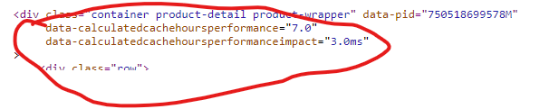

# lib_dynamiccaching: Storefront Reference Architecture (SFRA)

This is the repository for the lib_dynamiccaching plugin. This plugin adds dynamic page caching, including
the following capabilities:

* Dynamic stock based cache timings, based on Active Data

# Cartridge Path Considerations

The lib_dynamiccaching plugin requires the app_storefront_base cartridge. In your cartridge path, include the cartridges in
the following order:

```
plugin_dynamiccaching:lib_dynamiccaching:app_storefront_base
```

# Getting Started

1. Clone this repository. (The name of the top-level folder is lib_dynamiccaching.)
2. In the top-level plugin_gtm folder, enter the following command: `npm install`. (This command installs all of the
   package dependencies required for this plugin.)
3. In the top-level lib_dynamiccaching folder, enter the following command: `npm run uploadCartridge`

For information on Getting Started with SFRA,
see [Get Started with SFRA](https://documentation.b2c.commercecloud.salesforce.com/DOC1/index.jsp?topic=%2Fcom.demandware.dochelp%2Fcontent%2Fb2c_commerce%2Ftopics%2Fsfra%2Fb2c_sfra_setup.html)
.

# Configuration

You can find the config file `dynamic-caching.json` in the lib_dynamiccaching cartridge.

### Example

```json
{
   "inventoryLevelsChangeOften": false,
   "activeHoursInDay": 14,
   "minCacheTime": 1,
   "maxCacheTime": 24,
   "modifiers": {
      "day": 1,
      "week": 1,
      "month": 1
   }
}
```

## stockLevelsChangeOften
With this configuration file, you can manipulate the fallback cache time when Active Data is missing or unavailable.

* **_true_**: Your inventory changes often, possibly every hour, which means a short caching period is required if we can not take active Data into account.
* **_false_**: Your inventory only gets imported once a day

**Default value:** `false`

## activeHoursInDay
The standard Active Data keeps into account the total 24 hours of the day. But I have been told that people tend to sleep during some of these hours. This setting changes the 24 hours calculation to the specified amount of hours.

**Default value:** `14`

## minCacheTime
The shortest caching time that you want to allow. And it is also used to choose a fallback value if Active Data is unavailable.

**Default value:** `1`

## maxCacheTime
The longest caching time that you want to allow. And it is also used to choose a fallback value if Active Data is unavailable.

**Default value:** `24`

## modifiers
By default, all periods in Active Data carry the same weight in the calculation. You can use this configuration to modify that behavior.

**Default value:** `1`

# Product Details Template
The product details page has only been overwritten to add a data-attribute on the main `<div>` for debugging purposes.



# Release management

# NPM scripts

Use the provided NPM scripts to compile and upload changes to your sandbox.

## Linting your code

`npm run lint` - Execute linting for all JavaScript and SCSS files in the project.

## Watching for changes and uploading

`npm run watch` - Watches everything and recompiles (if necessary) and uploads to the sandbox. Requires a valid dw.json
file at the root that is configured for the sandbox to upload.